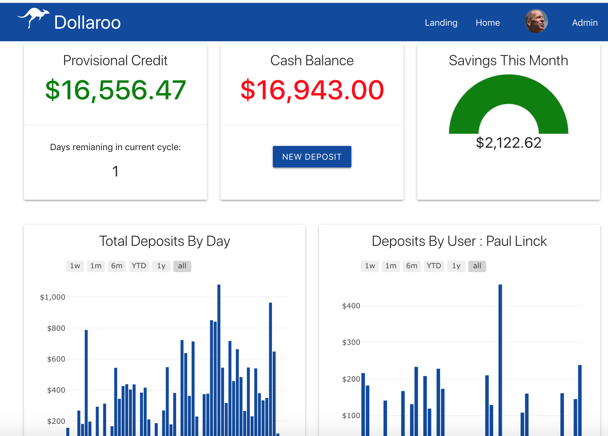
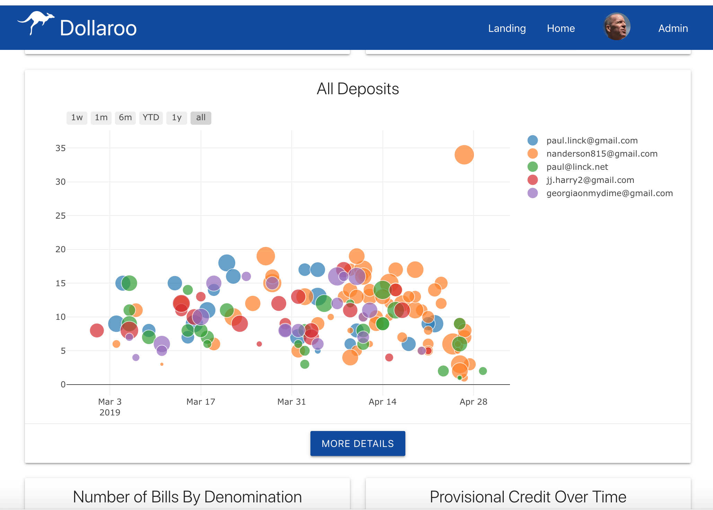
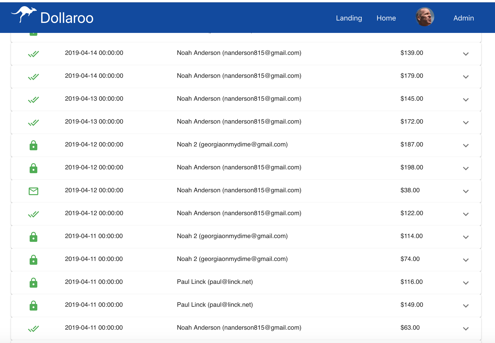
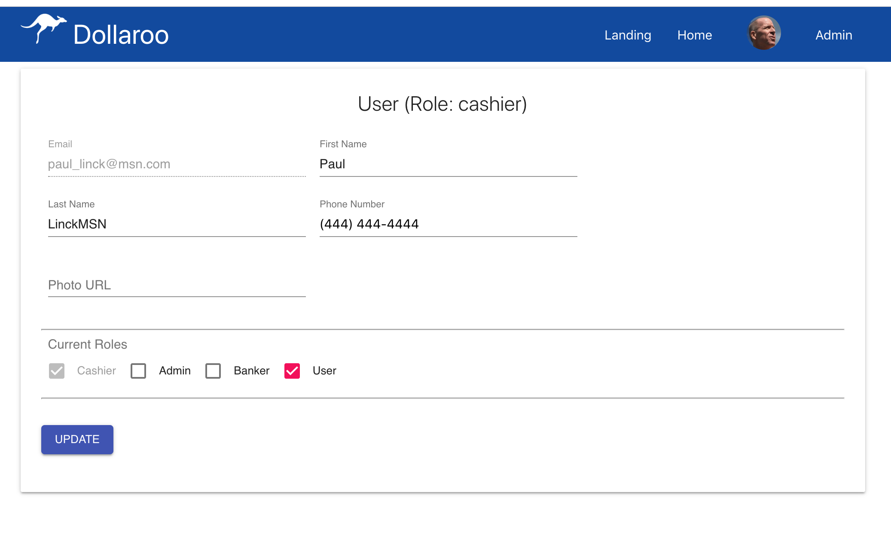
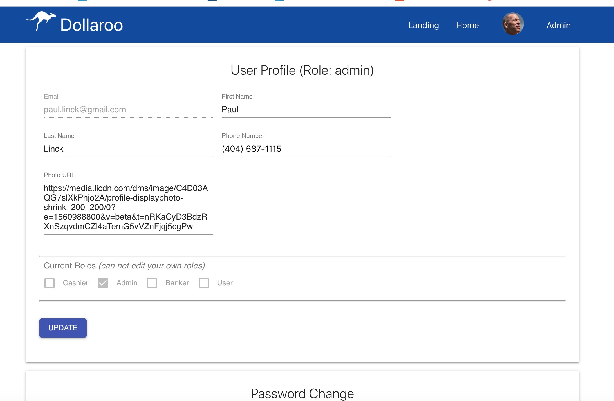
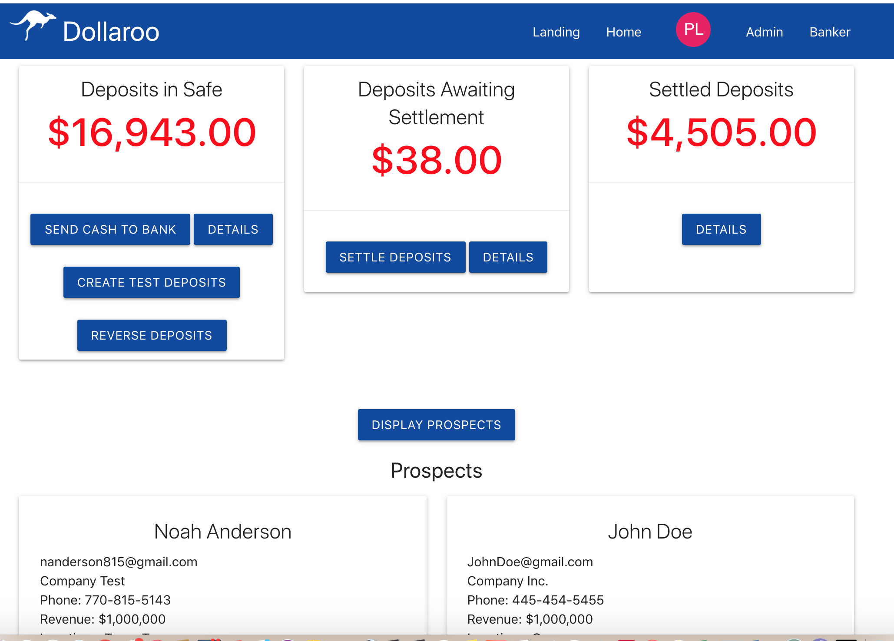

# Dollaroo

## Overview

Dollaroo is a cloud-based web and mobile application that imitates smart safe functionality with minimal upfront cost.

## Team

* [x] Noah Anderson [Noah Portfolio](https://noahanderson.dev)
* [x] Paul Linck [Paul Portfolio](https://paullinck.com/)
* [x] JJ Harry [JJ Portfolio](https://jjisharry.github.io/portfolio/)

### The Problem

Almost 30% of all retail transactions are by cash. In the US and Canada, $96b was spent on cash handling activites in 2017.  Average cost of cash across all retailers is 9.1%  Banks are increasingly abandoning solutions for cash-heavy clients in favor of serving customers digitally. As the payment mix changes, outdated products and processes have not been improved upon - leaving a gap in service.  Data gathered from a 2018 IHL Group Cost of Cash Study

“The primary issue is that the number of lanes that accept cash has increased….but the percentage of cash transactions has dropped. What is left is a process….that has become even more inefficient as the payment mix has changed.”
 -IHL Group

* Average Cost of Cash for Bars/Restaurants is: 15.5%, For Fast Food its 11.4%

### The Existing Process

Cash is collected from customers and stored in the drawer. Managers “Close” the drawer at the end of each shift
Manually sort and count bills. Reconcile with sales totals by hand (may require a re-count if discrepancies exist)
Manually input cash totals to POS software. Managers “Rebuild” drawer to starting cash amount for new shift
At the end of the dat, the manager will typically drive/walk the cash to a bank branch prior to the deposit cutoff time. Cash is held in locked canvas bag along with a deposit slip. Typically, locations will have a deposit relationship with whatever bank is closest. The company’s account department must manually consolidate funds into a company deposit account.

### Our Solution

A cloud-based web and mobile application that imitates smart safe functionality with minimal upfront cost.  Instant deposits of provisional credit via Realtime Payment Network. Smart bill counter to facilitate register closing.
Scalable Solution supports multiple locations. “Cash Recycle” function to rebuild registers without ordering more bills.
Store case in existing safe and deposit less frequently through method of choice. Cloud Based Analytics portal with a comprehensive deposit information and export functionality.

### Deposit Process

### Deployment

This is deployed to **Google Cloud Platform**.  GCP provides several huge advantages especially as it relates to security and hiding keys and credentials.  When app is running in test mode, sensitive data is stored in hidden files on developers local machine. When depoloyed to google cloud platform, the services keys, credentials etc are automatically protected and accessed inside the google cloud platform App engine.

NOTE: We also deployed to Herkou since GCP was charging fees given the services we are using.

## Links

* [Live Google Cloud Platform Site](https://project3-noahpauljj-fintech2.appspot.com)
* [Live HEROKU Link](https://project3-noahpauljj-fintech2.herokuapp.com)
* [GitHub for this](https://github.com/nanderson815/Project3/)
* [Paul Portfolio](https://paullinck.com/)
* [Noah Portfolio](https://noahanderson.dev)
* [JJ Portfolio](https://jjisharry.github.io/portfolio/)

## Technologies Used

* [x] HTML/CSS/Javascript
* [x] REACT, REACT Context
* [x] Node.js, Express
* [x] Firebase Auth with Custom Claims
* [x] Firebase Firestore for all secure data
* [x] MongoDB and Mongose (for Schemas, and non-secure data)
* [x] MongoDB Atlas Clusters
* [x] Axios (in node server and REACT components)
* [x] Materialize, MaterialUI
* [x] Google Cloud Platform
* [x] Plotly (for Graphing)

## Screenshots

## Architecture

### Security

Dollaroo deals with money and hence is very secure.  We are using firebase auth and google admin auth services for authentication and aiuthorization including custom user roles using firebase custom claims.  Custom claims can only be updated on the server side inside an authorized context of the app to keep this process secure - goodle does not allow these to be set in the client since it is not secure.  The app uses these custom claimns for role base security at 4 primary levels.  Currently we have 4 roles with different authorization with the app - admin, banker, cashier and user.

1. User can only see links and other UI objects that they are allowed to see for their role

2. REACT componments are wrapped in higher order components with authentication/aithorization context (using REACT context) and checked to ensure even if someone used inspector to go around the role based UI, it will preveent them from loading that compoent unless authorized.

3. All secure server transaction require auth context using secure token and are also checked based on auth role to prevent access to any server side services that are not allowed.

4. Firestore data is completely locked down using the auth customClaims so even if a hacker was sneaky enough to bypass all the client side security, they would be unable to update the data in any way.

See some of the rules below:

### Model View Controller (with lightweight controller routing to business and data logic)

* Views / `/client` - `/public` (dev) and `/build` (productoion) HTML/CSS/JS using REACT
  * Materialize JS and CSS
  * REACT Components

* Controllers - `/server.js` , `/routes` - REACT Static Routes and `/api` routes for Mongo and Fiebase Auth and Firebase Firestore

* Security - `/middleware`

* Model (Data) - `/model`
  * Uses Firebase Firestore for all secure data and transactions
  * Uses Mongo and Mongoose for Data Layer for insecure data like getting prospects from landing page
